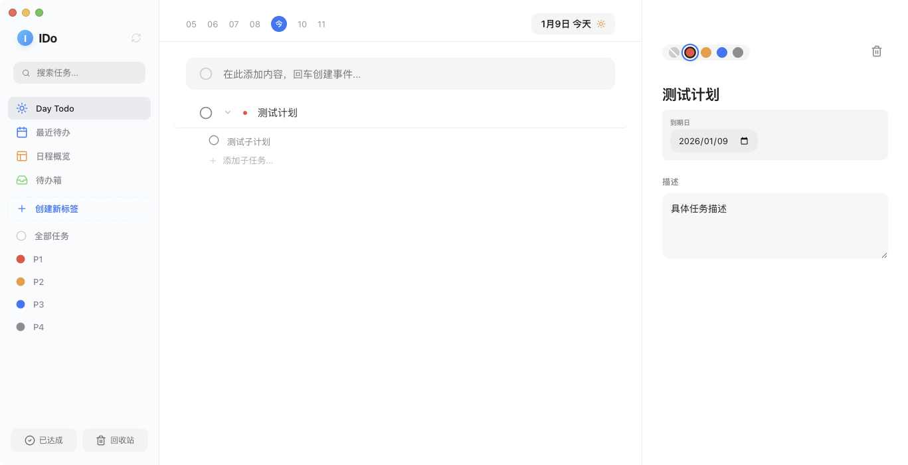
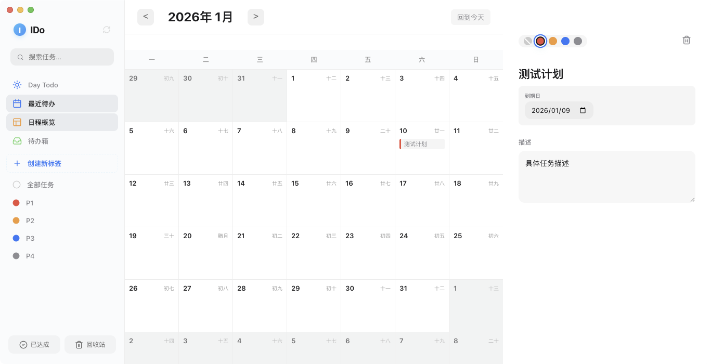

# IDo

<p align="center">
  
</p>

IDo is a fresh, minimalist, and high-performance cross-platform to-do list application. Built with Electron and React, it focuses on providing a fluid user experience with millisecond-level responsiveness.




## ✨ Features

- **Efficiency First**: Optimized with SQLite WAL mode and React Memoization for instant response even with 10,000+ tasks.
- **Visual Elegance**: Pixel-perfect UI with a calming Sky Blue theme (#00bfff) and smooth animations.
- **Calendar View**: Integrated calendar with Lunar date support and intuitive month navigation.
- **Task Management**:
  - Multi-level priorities (P1-P4)
  - Subtasks with progress tracking
  - Smart lists: Day Todo, Recent, Inbox
  - Soft delete & Recycle bin
- **Cross-Platform**: Native experience on macOS, Windows, and Linux.

## 📥 Installation

You can find the compiled installers in the `dist` folder:

- **macOS (Apple Silicon)**: `dist/IDo-1.0.0-arm64.dmg`
- **Windows**: `dist/IDo Setup 1.0.0.exe`
- **Linux**: `dist/ido_1.0.0_arm64.deb`

## 🛠 Tech Stack

- **Core**: Electron, React 19
- **State Management**: Zustand
- **Database**: better-sqlite3 (Native SQLite)
- **UI/Animation**: Framer Motion, Lucide React
- **Build Tool**: Electron Vite, Electron Builder

## 🚀 Getting Started

### Prerequisites

- Node.js (v18 or higher)
- npm or pnpm

### Development

```bash
# Install dependencies
npm install

# Start development server
npm run dev
```

### Build

```bash
# Build for all platforms
npm run build
npm run dist -- --mwl
```

## 📄 License

ISC
